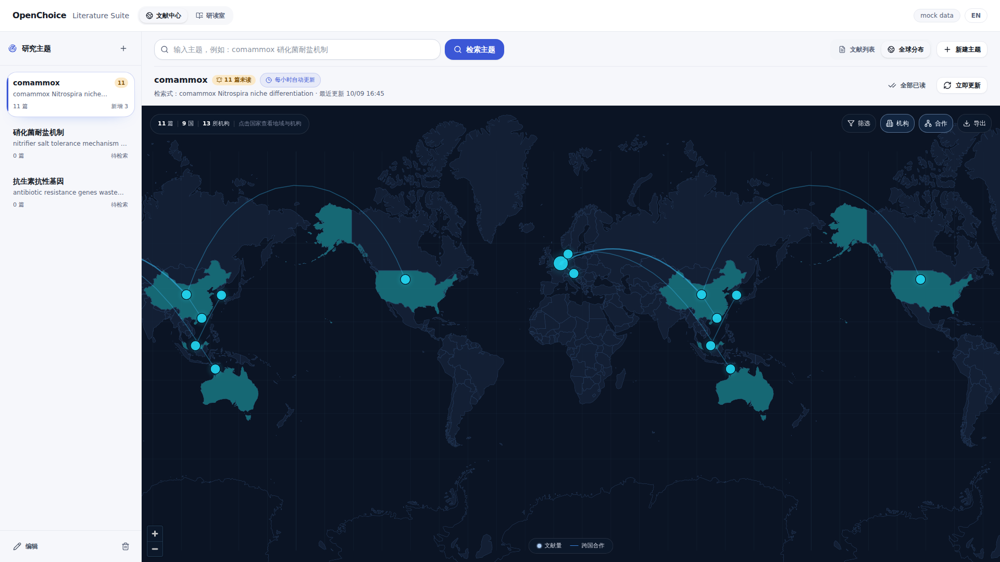
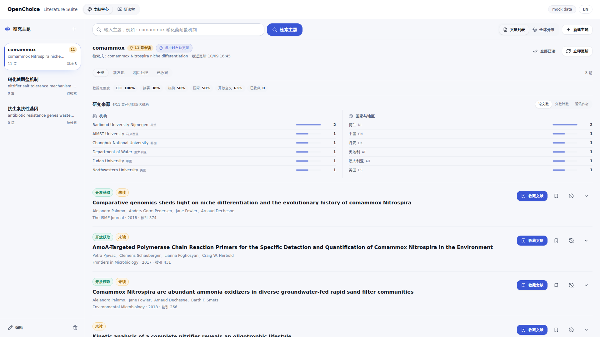
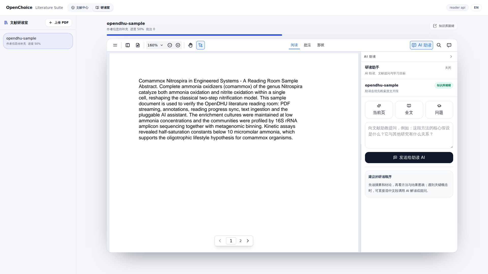
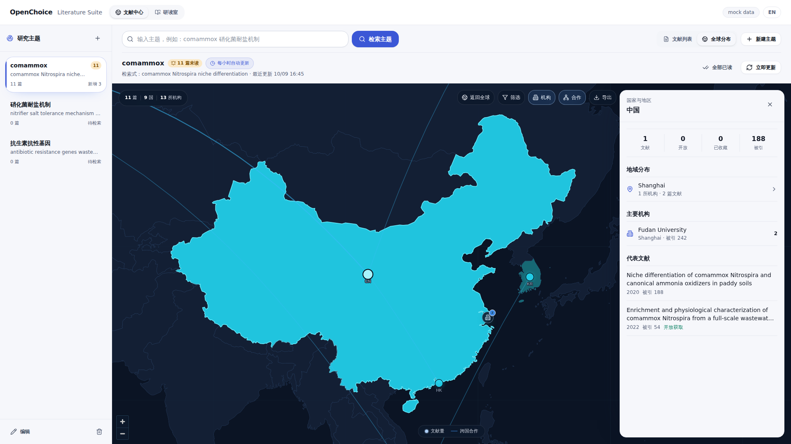
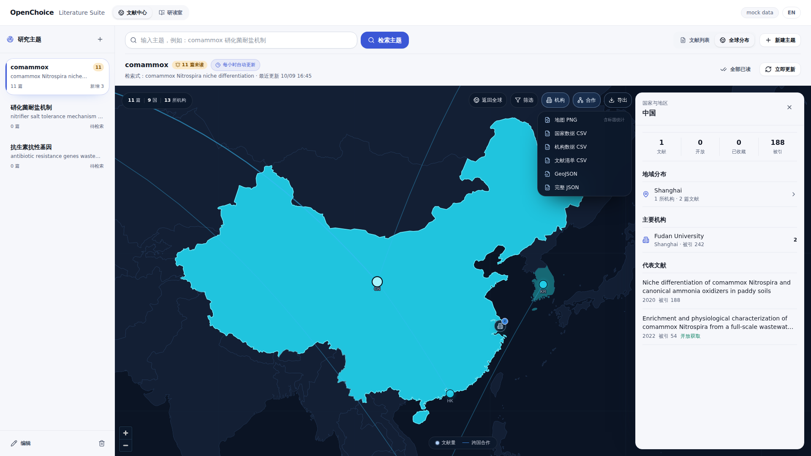
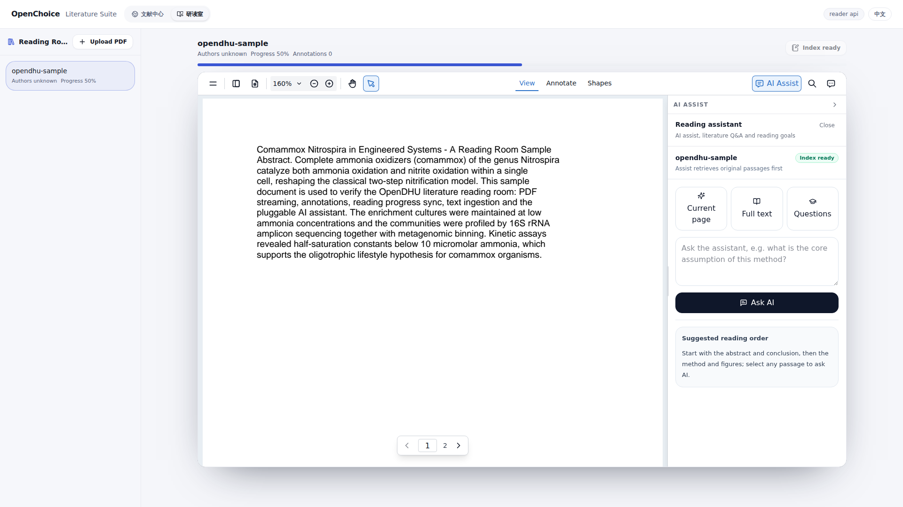

# OpenDHU · OpenChoice

[English](README.md) | **简体中文**

从 DHU BioEduOS 教学平台抽取的开源模块，演示中品牌为 **OpenChoice**。每个模块都可独立运行，不依赖宿主应用的 API 层、路由或鉴权。



## 模块

| 模块 | 截图 | 说明 |
| --- | --- | --- |
| [`@opendhu/literature-center`](packages/literature-center) |  | 学术文献发现（主题检索/覆盖度/来源榜）+ 全屏全球研究地图（MapLibre）：国家 → 地域 → 机构逐级下钻、跨国合作弧线、筛选与 PNG/CSV/GeoJSON/JSON 导出。 |
| [`@opendhu/literature-reader`](packages/literature-reader) |  | 文献研读室：EmbedPDF/Pdfium 阅读器、原生批注、阅读进度与阅读状态同步、AI 助读面板、跨文献问答，内置 zh-CN/en-US 多语言系统。 |
| [`backend/`](backend) | — | Rust（axum + sqlx + pgvector）研读室后端：书架、上传、鉴权 PDF 流、阅读状态、解析入库管线，以及可插拔的 OpenAI 兼容 AI。 |

## 界面截图（1920×1080 实拍）

| 界面 | 预览 |
| --- | --- |
| 文献中心 · 发现列表 |  |
| 全球研究地图 |  |
| 国家下钻（地域 / 机构 / 代表文献） |  |
| 地图导出（PNG · CSV · GeoJSON · JSON） |  |
| 文献研读室 · 中文 |  |
| 文献研读室 · English（`ReaderI18nProvider`） |  |

截图均来自真实运行的演示（文献中心为内存 mock；研读室为 Rust API + Postgres + 真实 PDF）。

## 架构

```
apps/demo                    Vite 演示应用：文献中心（mock 客户端）
                             + 研读室（reader-api + EmbedPDF 运行时）
packages/literature-center   文献发现 + 全球地图组件（React 18 / Tailwind 4）
packages/literature-reader   研读室组件 + 多语言（React 18 / Tailwind 4）
backend                      Rust 工作区
  crates/reader-api          axum：路由、仓储、鉴权、LLM 适配器、解析管线
  crates/reader-db           sqlx 连接池 + 迁移（文献、状态、RAG 文档）
docker-compose.yml           Postgres（pgvector）+ reader-api
```

两个前端包都与后端解耦：宿主通过 `LiteratureCenterClient` /
`LiteratureReaderClient` 注入数据源，包内附带参考 REST 契约的 HTTP 客户端。

## 快速开始

依赖：Node.js ≥ 20、pnpm、Docker（研读室后端）、Rust ≥ 1.88（仅在 Docker 外构建后端时需要）。

```bash
# 1. 后端：Postgres + pgvector + reader API（:8790）
docker compose up -d --build

# 2. 演示前端（:5181）
pnpm install
pnpm dev
```

打开 http://127.0.0.1:5181，演示包含两个页签：

- **文献中心** — 完全离线运行（内存 mock 客户端）：主题检索、全球地图、下钻、导出。
- **研读室** — 连接 Rust API（演示登录，无密码）：上传 PDF、阅读、批注、进度同步与 AI 助读。

### AI（可选）

不配置 AI 也能完整使用阅读、批注、进度与关键词检索。配置 OpenAI 兼容 Key 后重建即可启用 AI 助读与跨文献问答：

```bash
export LLM_API_KEY=sk-...
docker compose up -d --build
```

## 配置

| 位置 | 变量 | 默认值 | 说明 |
| --- | --- | --- | --- |
| reader API | `DATABASE_URL` | — | Postgres 连接串 |
| reader API | `READER_BIND` | `0.0.0.0:8790` | HTTP 监听地址 |
| reader API | `READER_DATA_DIR` | `./data` | PDF 存储目录 |
| reader API | `READER_JWT_SECRET` | 开发密钥 | 演示登录令牌密钥 |
| reader API | `LLM_API_KEY` | — | 启用 AI 与向量化 |
| reader API | `LLM_BASE_URL` | `https://api.openai.com/v1` | OpenAI 兼容地址 |
| reader API | `LLM_CHAT_MODEL` | `gpt-4o-mini` | 对话模型 |
| reader API | `LLM_EMBED_MODEL` | `text-embedding-3-small` | 向量模型 |
| demo | `VITE_READER_API` | 同主机 :8790 | 研读后端地址 |

完整端点列表见 [`backend/README.zh-CN.md`](backend/README.zh-CN.md)。

## 开发

```bash
pnpm typecheck        # 全部包 + demo 的 TS 检查
pnpm build            # 库构建 + demo 构建
pnpm dev              # demo 开发服务器
cd backend && cargo run -p reader-api   # 后端开发服务器
```

演示的研读室从 `apps/demo/public/embedpdf` 加载 EmbedPDF/Pdfium 运行时。
替换该运行时后，需要重新应用本地化钩子：

```bash
node scripts/patch-embedpdf-i18n.mjs
```

## 路线图

- 页级 chunk 元数据，支持“当前页”范围的精确 AI 助读（需要版面感知的 PDF 解析）
- 从源码重建 EmbedPDF snippet，去掉 bundle 补丁
- 研读室暗色模式
- 更多语言（通过 `registerReaderMessages` 随时注入）

## 许可证

MIT
